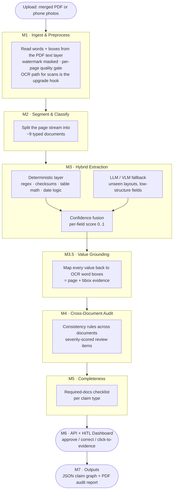
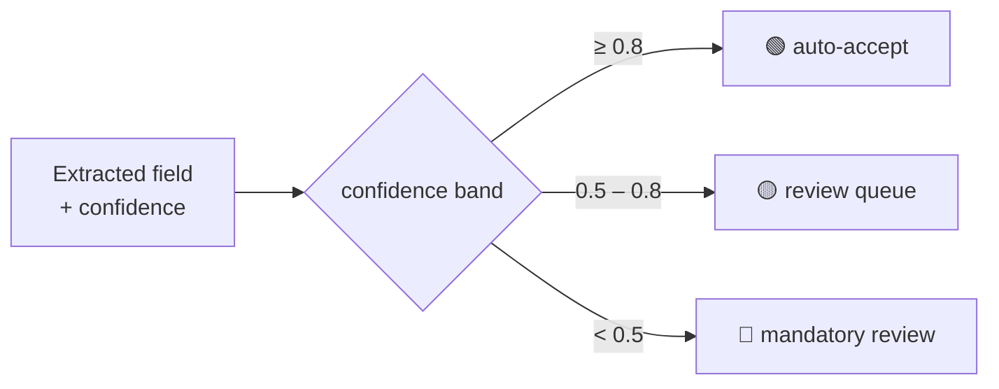

# MediProof

**A claim-readiness audit engine for Indian health-insurance claim files.**


MediProof takes a merged claim file — discharge summary, hospital bill, pharmacy bills, lab
reports, prescriptions, and so on — and produces three things:

1. **Structured JSON** of every extracted field, each with a confidence score and evidence.
2. A severity-scored **audit report** of documentation problems (inconsistencies,
   arithmetic errors, missing documents, tampering signals).
3. A reviewer **dashboard** with confidence-coloured fields and click-to-source highlighting.

Positioning: a patient/hospital-side **pre-submission audit** — catch the documentation
problems that get claims rejected *before* the file is ever submitted.

> [!IMPORTANT]
> MediProof is **documentation QA**. It does **not** make clinical judgments, adjudicate
> claims, or determine payment. Every output is an input to human review. Findings are
> *review items*, never accusations — the words "fraud" and "reject" appear nowhere in the
> product.

---

## The problem, in one paragraph

A health-insurance claim in India is a stack of 20–40 pages from half a dozen sources: a
hospital bill, a discharge summary, pharmacy receipts, lab reports, a claim form, ID proofs.
Claims get rejected not because the treatment was wrong but because the *paperwork* is
inconsistent — the bill totals don't add up, a medication is billed but never prescribed, a
lab test is charged for but the report is missing, a date is off. MediProof reads the whole
bundle, extracts every field, and cross-checks the documents against each other so a human
reviewer can fix the problems before filing.

## How it works



The core idea is **hybrid extraction**: cheap, deterministic rules do most of the work and
carry the highest confidence; an LLM is only called for the fields rules can't fill. Every
field then gets a confidence score that decides whether a human ever needs to look at it.



This is what makes the headline metric possible: *"review the bottom X% of fields by
confidence to reach Y% accuracy."*

## Benchmarks

Numbers below are produced by `make eval` on **synthetic, digital** claim PDFs (a real
text layer, no OCR noise) — so extraction is near-perfect by construction. The honest
synthetic-to-real gap (scanned/phone-photo documents through the OCR path) is future work
and will be reported openly here rather than hidden.

<!-- BENCHMARK:START -->

_Auto-generated by `make eval` over 23 synthetic claims (16 clean, 7 with a seeded fault). Fully reproducible from seeds._

**Document classification** (P0 keyword baseline)

- accuracy: **100.0%** (149/149 documents)

**Field extraction** (deterministic layer, vs ground truth)

| Document type | Exact match | Normalized match |
|---|---|---|
| discharge_summary | 100.0% | 100.0% |
| hospital_bill | 100.0% | 100.0% |
| lab_report | 100.0% | 100.0% |
| pharmacy_bill | 100.0% | 100.0% |
| prescription | 100.0% | 100.0% |
| **all** | **100.0%** | **100.0%** |

**Audit engine** (per fault type, vs injected ground truth)

| Fault type | Recall |
|---|---|
| bill_arithmetic_error | 100.0% (1/1) |
| date_mismatch | 100.0% (1/1) |
| drug_diagnosis_mismatch | 100.0% (1/1) |
| duplicate_billing | 100.0% (1/1) |
| inflated_line_item | 100.0% (1/1) |
| missing_lab_report | 100.0% (1/1) |
| name_mismatch | 100.0% (1/1) |

- **False-positive rate on clean files:** 0.00 severe review items per clean claim (0 across 16).

**Coverage–accuracy** (route the lowest-confidence fields to review)

| Sent to review | Auto-accepted | Accuracy of auto-accepted |
|---|---|---|
| 0% | 100% | 100.0% |
| 10% | 90% | 100.0% |
| 20% | 80% | 100.0% |
| 30% | 70% | 100.0% |

**Hybrid unit economics**

- deterministic layer fills **96.2%** of extracted fields; **0 LLM calls** were needed across the whole set (the LLM only touches low-confidence fields).
- median end-to-end latency: **265 ms/claim** (digital path, no OCR).


<!-- BENCHMARK:END -->

## Build status

Built in the open, one module per session, against a fixed 8-week plan
(see [plan.md](plan.md)). The end-to-end pipeline, API, dashboard, and eval harness are all
in — **87 tests passing**.

| Module | What's in | State |
|--------|-----------|-------|
| `schemas/` | Pydantic v2 contracts (ground-truth *certain* · extraction *uncertain*) | ✅ done |
| `datagen/` | seeded generator, 5 doc templates, **7-fault injector** (MediClaim-Bench) | ✅ done |
| `m1_ingest` | digital text-layer words+boxes, watermark mask, quality gate | ✅ done |
| `m2_segment` | P0 keyword classifier + boundary detection | ✅ done |
| `m3_extract` | deterministic regex+validators · LLM fallback (record/replay) · confidence fusion | ✅ done |
| `m3.5 ground` | value → bbox evidence (rapidfuzz) | ✅ done |
| `m4_audit` | config-driven rule pack → severity-scored review items | ✅ done |
| `m5_complete` | required-docs checklist | ✅ done |
| `api/` | FastAPI + SQLModel; upload · process · review · page images | ✅ done |
| `ui/` | React + Vite + Tailwind HITL dashboard (4 interactions) | ✅ done |
| `evals/` | metrics harness → auto-generated README tables | ✅ done |
| Docker | `docker-compose` (api + dashboard) · `make demo` | ✅ done |
| W8 polish | OCR path for scans · LayoutLMv3 upgrade · calibration (ECE) · real-sample gap | ⬜ next |

### What works today

The whole thing runs: upload a claim PDF → it's ingested (words + boxes), segmented into typed
documents, extracted field-by-field with per-field confidence, every value grounded to a
bounding box, cross-checked by the audit engine, and served to a dashboard where a reviewer
clicks a finding to see its evidence and corrects fields inline. See the **Benchmarks** above
for the numbers, all produced by `make eval`.

> **Honest scope.** Extraction runs on the **digital text layer** of the synthetic PDFs, so the
> numbers are near-perfect. Real scanned/phone-photo documents need the OCR path (OpenCV +
> PaddleOCR) — that's the next block of work, and its synthetic-to-real gap will be reported
> here openly. The LLM fallback is fully wired via record/replay but rarely fires on clean
> digital claims (the deterministic layer fills ~96% of fields) — which is exactly the hybrid
> cost argument.

## Quickstart

Requires Python 3.11+ (and Node 20+ / Docker for the dashboard). On Windows, `make` is
optional — use `./run.ps1 <target>` instead.

```bash
# 1. environment + deps (+ headless Chromium for datagen PDF rendering)
python -m venv .venv
make install-dev          # or: ./run.ps1 install-dev

# 2. one synthetic claim (with a seeded inflated line item) → PDFs + ground truth
make datagen-sample       # or: ./run.ps1 datagen-sample

# 3. run the full test suite (golden-file · pipeline · API · eval)
make test                 # or: ./run.ps1 test

# 4. regenerate the benchmark tables above
make eval                 # or: ./run.ps1 eval
```

### See it end-to-end (the dashboard)

```bash
make demo                 # or: ./run.ps1 demo
# builds the compose stack (FastAPI + React), seeds a faulty claim, opens the dashboard:
#   Dashboard  http://localhost:5173     API  http://localhost:8000
```

Or drive the API directly:

```bash
uvicorn api.app:app --reload
curl -F "file=@data/sample/claim.pdf" "http://localhost:8000/claims?claim_id=demo"
curl http://localhost:8000/claims/demo | jq '.findings[] | {type, severity, detail}'
```

A generated ground-truth record looks like this (seed 42, abridged):

```json
{
  "claim_id": "CLAIM-000042",
  "claim_type": "cashless_hospitalization",
  "patient": { "name": "Advik Maharaj", "age": 68, "gender": "M", "patient_id": "UHID207473" },
  "documents": [
    {
      "doc_type": "hospital_bill",
      "hospital": { "name": "Sunrise Multispeciality Hospital", "registration_no": "KA/HOSP/2011/4471" },
      "admission_date": "2024-09-09",
      "discharge_date": "2024-09-12",
      "line_items": [
        { "description": "Room Rent (Semi-Private)", "quantity": 3.0, "unit_price": 3719.62, "amount": 11158.86 }
      ]
    }
  ]
}
```

## Repo layout

```
schemas/     Pydantic v2 contracts — the single source of truth (see CLAUDE.md)
datagen/     synthetic generator (MediClaim-Bench) + fault injector
pipeline/    m1_ingest · m2_segment · m3_extract · m4_audit · m5_complete
api/         FastAPI app
ui/          React dashboard
evals/       eval harness (CLI) + golden files
tests/       pytest; golden-file tests per module
```

## Design principles

These are enforced conventions, not aspirations (full text in [CLAUDE.md](CLAUDE.md)):

- **Contracts-first.** `schemas/` is the single source of truth. Every module imports its
  types from there; a schema change is a breaking change to everything downstream.
- **Deterministic seeds everywhere.** A fixed seed reproduces byte-identical ground truth —
  reproducibility is non-negotiable and CI checks it.
- **LLM record/replay.** Every LLM call goes through one thin client that records responses
  to fixtures. Tests and CI replay from fixtures — deterministic, free, fast. Live calls
  only behind `LLM_LIVE=1`, under a hard `LLM_BUDGET_USD` cap.
- **The pipeline never crashes on a bad LLM reply.** A reply must parse into the target
  field's schema; on failure it retries with error feedback (max 2), then emits
  `value=null, confidence=0`.
- **Golden-file tests per module.** Input fixtures → expected JSON outputs, checked in.
  Regressions fail CI.

## Data, safety & ethics

- **Synthetic only.** The public repo and the MediClaim-Bench dataset contain synthetic data
  only. All hospitals, labs, and insurers are fictional; every page carries a
  `SPECIMEN — SYNTHETIC DATA` watermark.
- **Privacy (DPDP posture).** Health data is sensitive personal data. Any real sample used
  for the synthetic-to-real honesty check stays local, is de-identified first, and is
  **never** committed. A CI PII scan (Aadhaar / PAN / phone patterns) guards every push.
- **Reproducible & auditable.** Because datagen is fully seeded, every reported number can be
  regenerated from a seed.
- **Sources.** ICD-10 (WHO), drug names from open government lists (Jan Aushadhi / NLEM),
  non-payable consumables from the IRDAI-aligned standard list — cited as the datasets land.

## License

[Apache-2.0](LICENSE). Contracts in `schemas/` are human-owned; see [CLAUDE.md](CLAUDE.md)
for the agent conventions that keep this AI-assisted codebase coherent.
